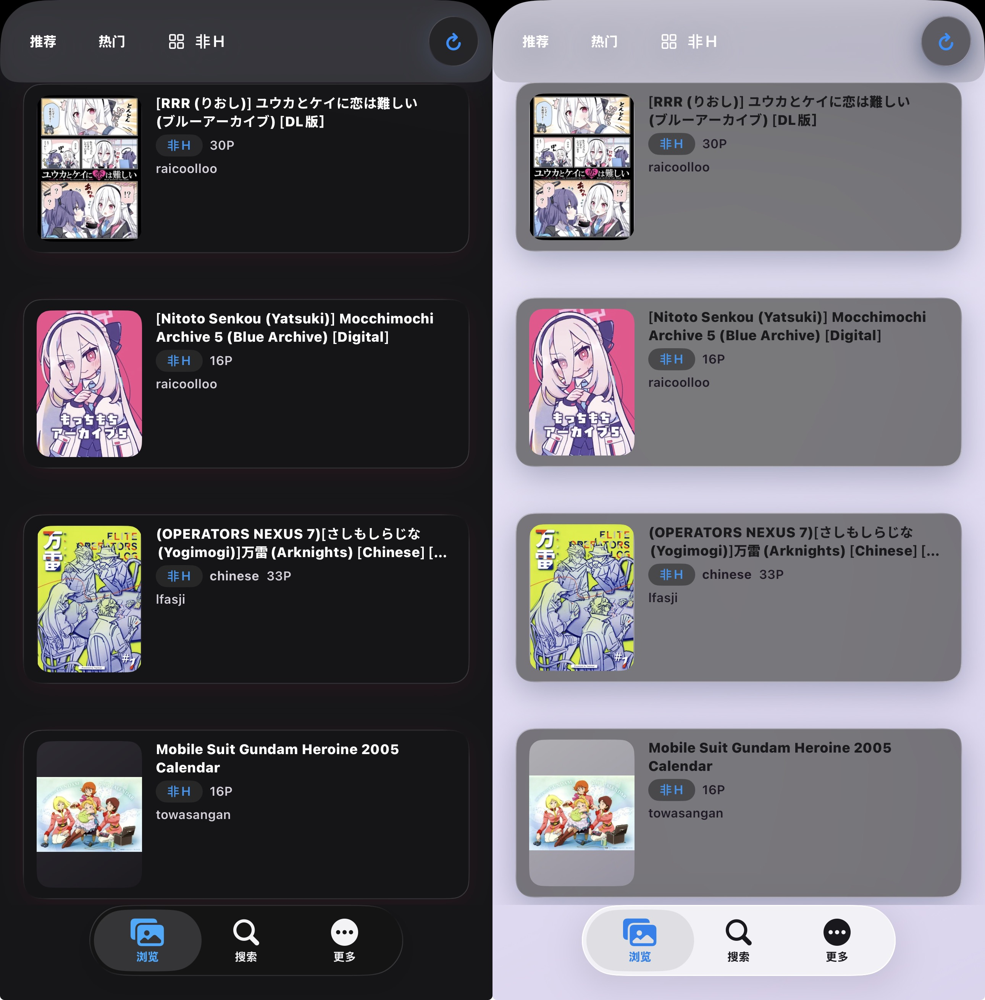
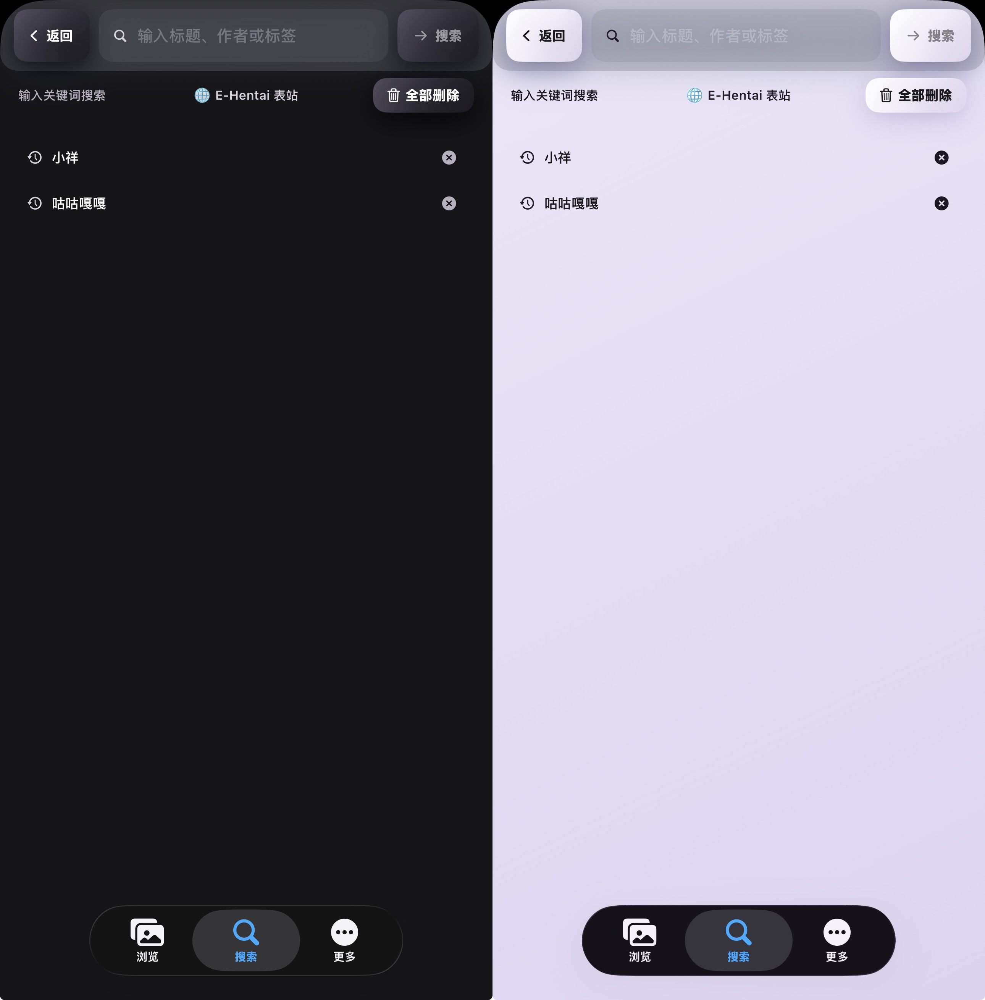
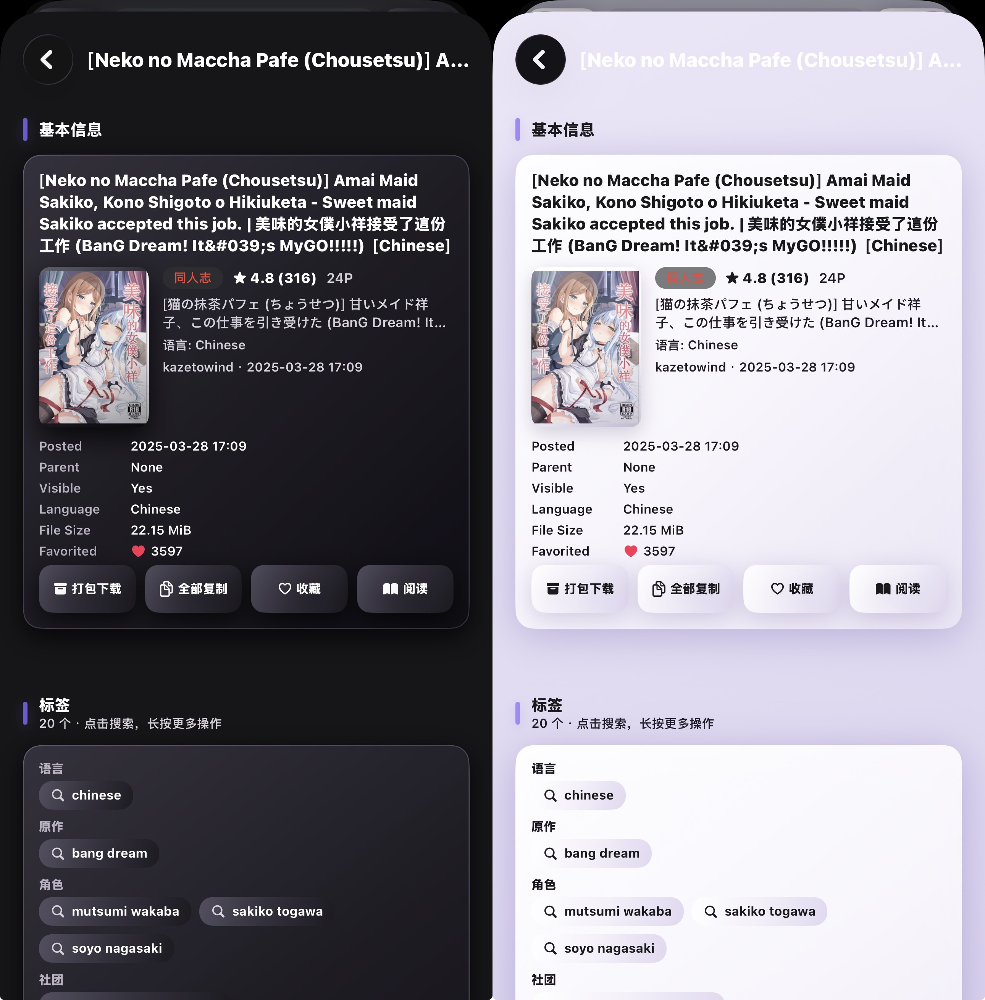
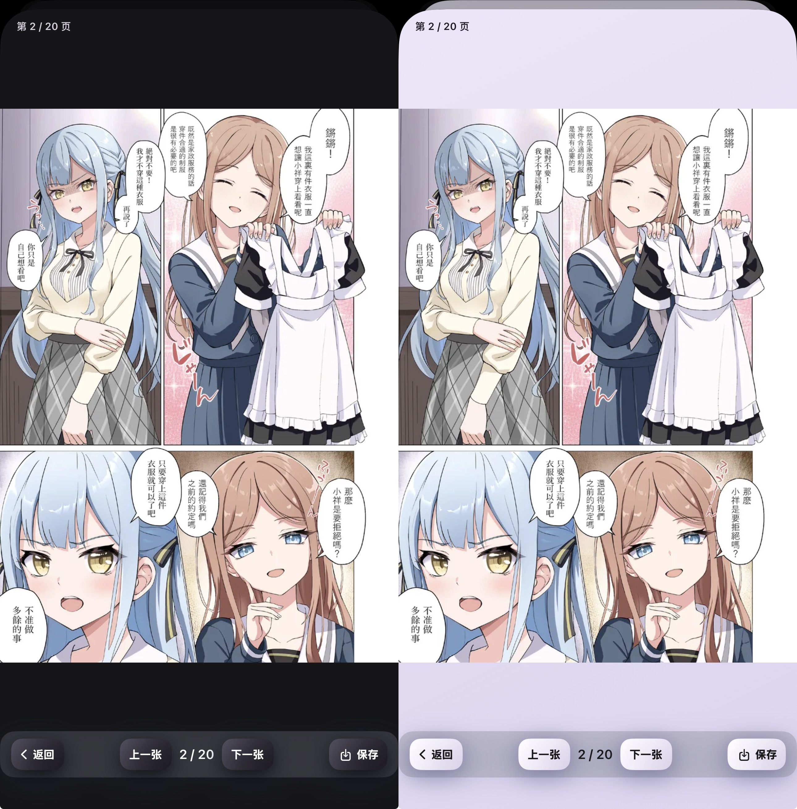
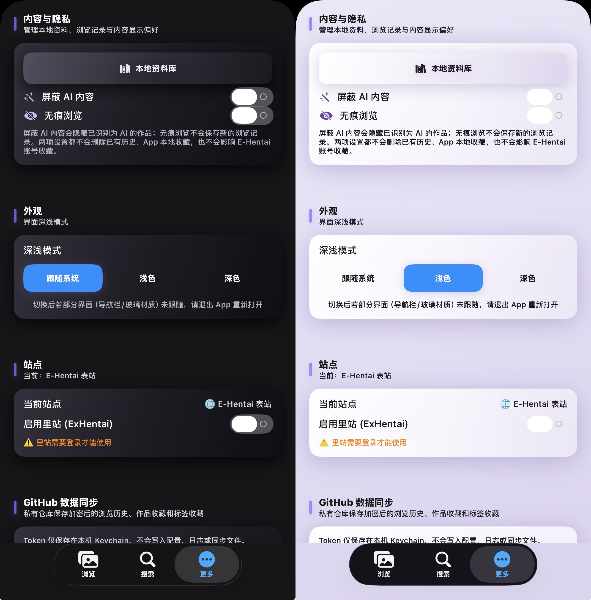

# SEhViewer

一个运行在 iOS 上的 E-Hentai / ExHentai 阅读器，基于 [Scripting](https://scripting.fun) 应用构建，界面采用 iOS 26 风格的 Liquid Glass 液态玻璃材质。

> 本项目基于 [JSEhViewer](https://github.com/Gandum2077/JSEhViewer) 修改而来

---

## 截图

| 首页 / 推荐 | 搜索 | 详情页 |
| --- | --- | --- |
|  |  |  |

| 阅读器（单张） | 阅读器（拼接滚动） | 设置 |
| --- | --- | --- |
|  |  |  |

---

## 功能特性

### 📖 浏览
- **推荐页**：登录后拉取 `/home.php` 个性化推荐；未登录自动回退到热门榜单
- 最新发布、热门、我的订阅、收藏夹、Toplist、最新上传等多种列表
- **分类筛选**：内置 E-Hentai 全部 10 个分类，可任意组合
- 列表卡片显示封面、标题、页数、大小、**语言徽标**（language 标签自动识别）、**AI 内容紫色徽标**

### 🔍 搜索
- 标题 / 作者 / 标签关键词搜索，原生支持 `namespace:tag` 语法
- **搜索历史**：本地保存最近 20 条，支持单条删除、一键全部删除
- 详情页的标签可直接点击，跳转全屏结果页继续搜同标签

### 🖼️ 阅读器
- **单张模式**：左右滑动或点击屏幕左右边缘翻页，方向（左→右 / 右→左）可自定义
- **拼接滚动模式**：像长图一样连续滚动，支持横向 / 纵向拼接
- **底部栏一键保存任意图片保存到相册**

### ⬇️ 下载
- **整本打包**：一键下载全部图片并打包成 zip，可存文件 / 分享；下载过程可随时取消
- 单张保存：任意页面直接存入系统相册

### 🍪 Cookie 与登录
- 支持表站（e-hentai.org）免登录浏览，里站（exhentai.org）需登录
- 配套浏览器脚本（`browser.tsx` / userscript）：在 Safari 打开 E-Hentai 页面时，左下角悬浮按钮一键抓取 Cookie 写入本地文件，app 内"从浏览器导入"即可完成登录
- Cookie 仅保存在本地，**不会上传到任何服务器**
- 设置页可随时清除本地 Cookie、查看登录状态

### 🎨 界面与体验
- 全界面 **Liquid Glass 液态玻璃**材质，深浅色自适应（跟随系统 / 浅色 / 深色）
- 请求超时重试、Cloudflare 检测、缩略图错峰加载

---

## 安装

1. 在 iPhone / iPad 上安装 [Scripting](https://scripting.fun)（App Store）
2. [点此](https://www.scripting.fun/import_scripts/?urls=%5B%22https%3A%2F%2Fraw.githubusercontent.com%2FZerolost%2FSEhViewer%2Fmain%2Fdocs%2FSEhViewer.scripting%22%5D)或将将本仓库 Releases 导入 Scripting 即可
3. 运行 SEhViewer 项目开始体验

### 使用提示

- 无登录打开仅能浏览表站
- 进入里站需要先在 Safari 登录 E-Hentai 账号，用配套脚本抓取 Cookie，再回 app 设置页点击"从浏览器导入"
- 阅读方向、翻页方式、左右边缘点击动作都可在阅读器内 / 设置页调整

---

## 项目结构

```
SEhViewer/
├── index.tsx      # 主界面与全部 UI
├── api.ts         # 请求、重试、HTML 解析、Cookie 管理
├── types.ts       # 类型定义与工具函数
├── browser.tsx    # Safari 浏览器脚本（Cookie 抓取助手）
└── script.json    # Scripting 项目配置
```

---

## 隐私说明

- 所有数据均存储在本地
- 本项目不含任何统计、上报、遥测代码
- 请妥善保管自己的 Cookie，不要分享给他人

---

## 免责声明

本项目仅供学习交流使用。所有内容版权归原作者所有，请勿用于任何商业用途；使用本项目时请遵守 E-Hentai 的服务条款。因使用本项目产生的一切后果由使用者自行承担。

## License

[MIT](LICENSE)
